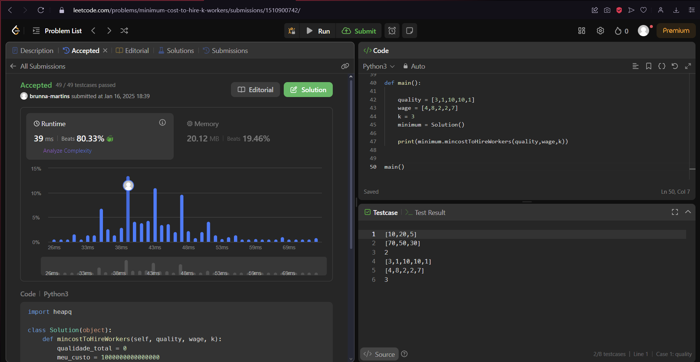
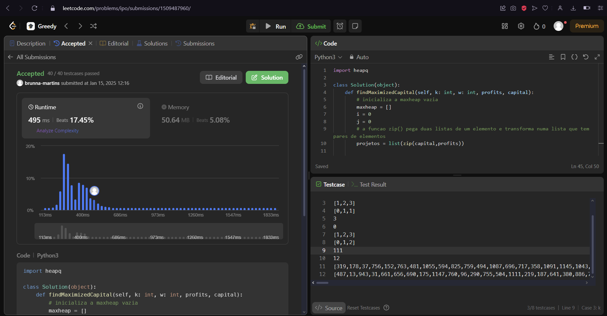
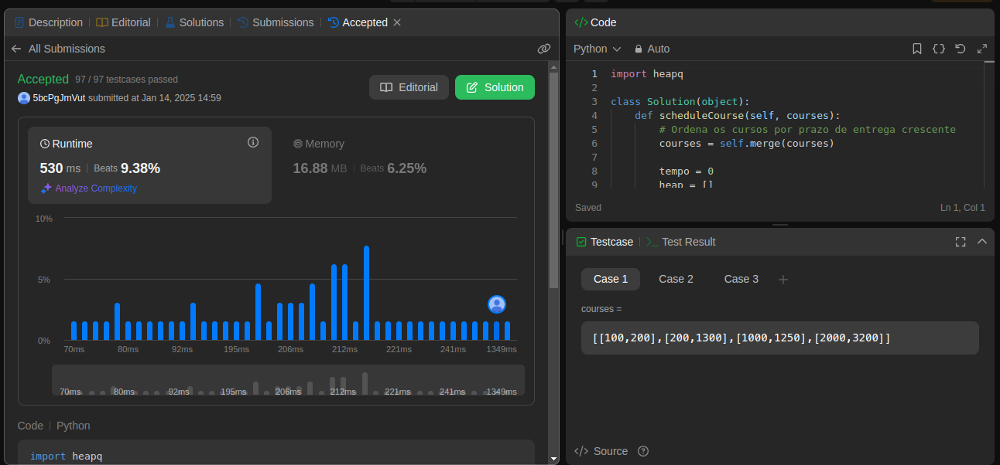

# Greedy Algorithms - Questões de LeetCode

**Número da Lista**: 4<br>
**Conteúdo da Disciplina**: Greedy Algorithms<br>

## Alunos
|Matrícula | Aluno |
| -- | -- |
| 21/1029156  |  [Brunna Louise Martins Rocha](https://github.com/brunna-martins) |
| 21/1043727  |  [Pedro Cabeceira de Freitas](https://github.com/pkbceira03) |

## Sobre 
O projeto consiste na resolução de 3 exercícios da plataforma LeetCode.

### Minimum Cost to Hire K Workers (Hard)

Link do Problema: [clique aqui](https://leetcode.com/problems/minimum-cost-to-hire-k-workers/description/) <br>
Link do Código (GitHub): [clique aqui](https://github.com/projeto-de-algoritmos-2024/Greedy-LeetCode/blob/master/minimum_cost.py) <br><br>
<br>

### IPO (Hard)

Link do Problema: [clique aqui](https://leetcode.com/problems/ipo/description/) <br>
Link do Código (GitHub): [clique aqui](https://github.com/projeto-de-algoritmos-2024/Greedy-LeetCode/blob/master/IPO.py) <br><br>
<br>

### Course Schedule III (Hard)

Link do Problema: [clique aqui](https://leetcode.com/problems/course-schedule-iii/description/)<br>
Link do Código (GitHub): [clique aqui](https://github.com/projeto-de-algoritmos-2024/Greedy-LeetCode/blob/master/Course_ScheduleIII.py) <br><br>
 <br>


## Instalação 
**Linguagem**: Python<br>
**Framework**: n/a<br>

**Ubuntu**:

Para rodar, é preciso ter instalado o Python 3.

```
$ sudo apt-get update
$ sudo apt-get install python3.6
```

## Uso 
Para testar o código na IDE de sua preferência, após realizada a instalação do Python3, você deve instanciar a classe Solution de cada arquivo. Em seguida, chame a primeira função declarada em cada arquivo com a quantidade e o tipo de argumentos especificados. Lembre-se de chamá-la dentro de uma função print() para visualizar o retorno do algoritmo via terminal.

O código está otimizado para rodar no ambiente do LeetCode. Basta copiar e colar o código no link da respectiva questão (consultar links acima).

## Apresentação
[Clique aqui](https://www.youtube.com/watch?v=eZt-yGgu1xA) para acessar o vídeo no YouTube.


